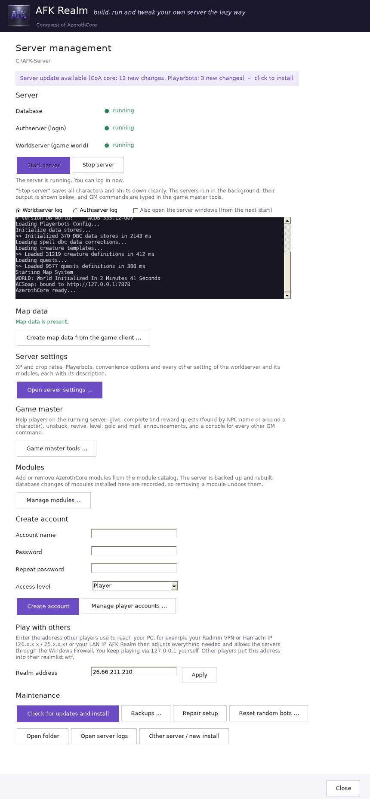
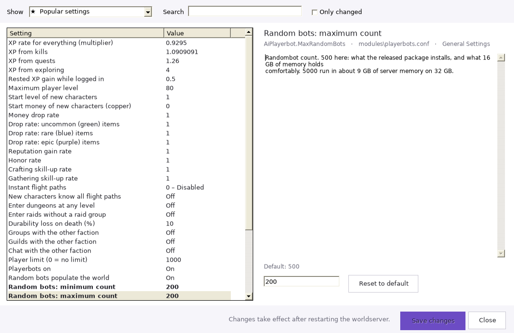
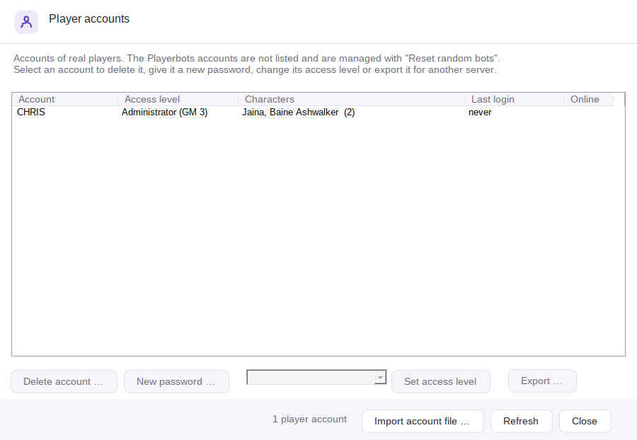
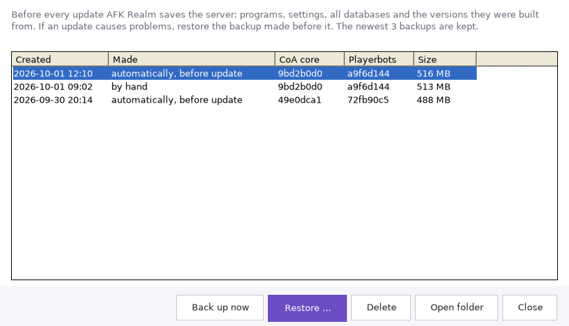
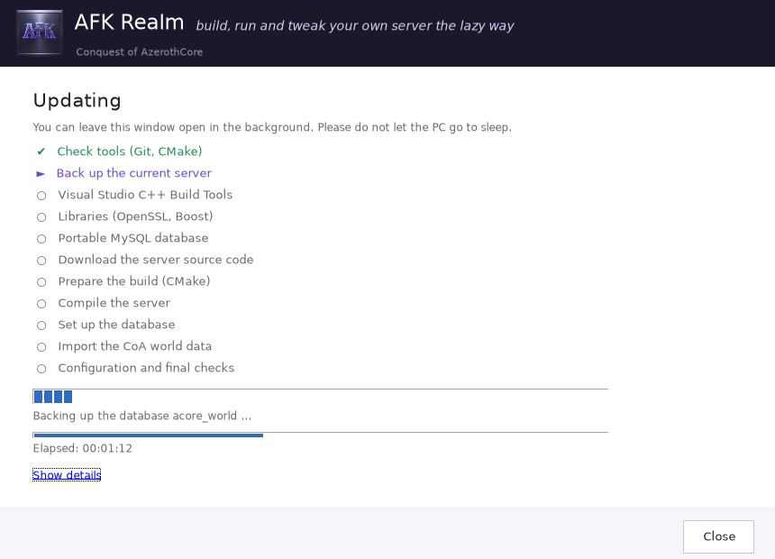
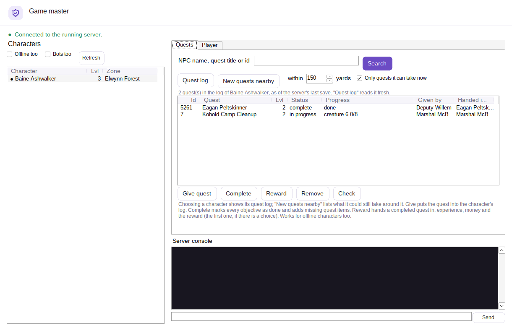
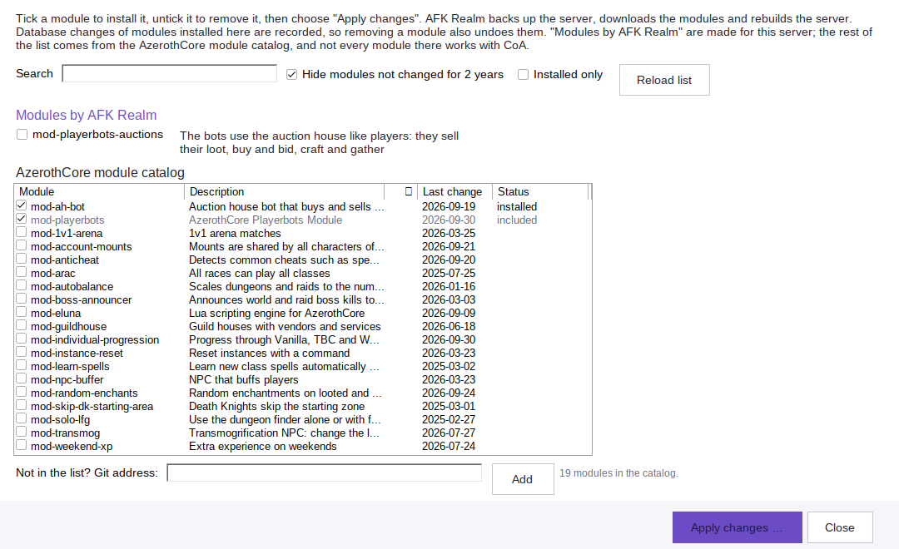
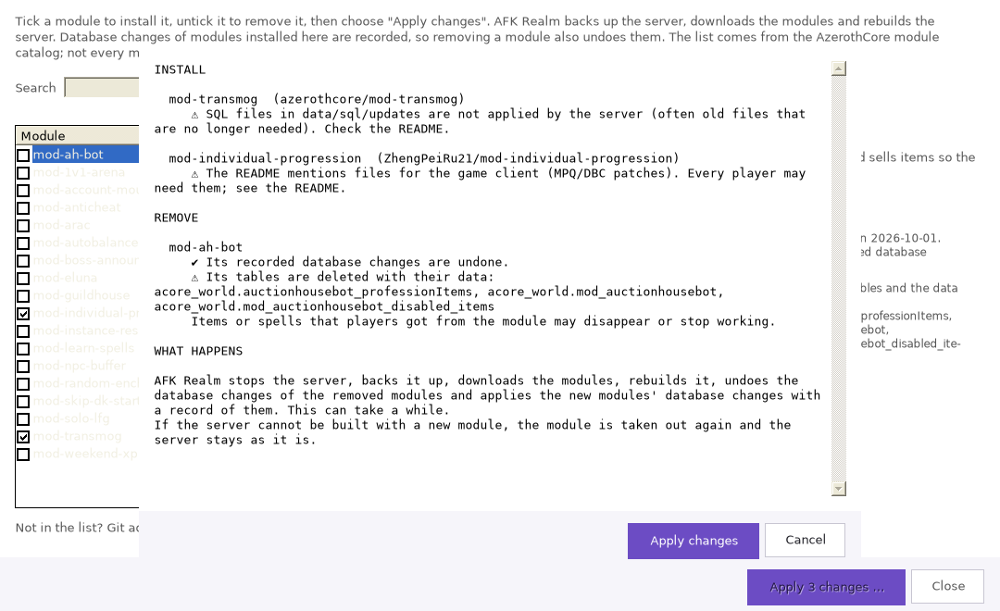
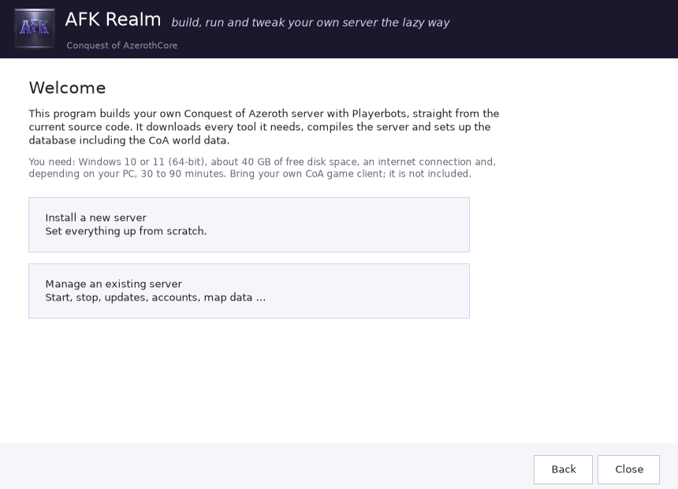
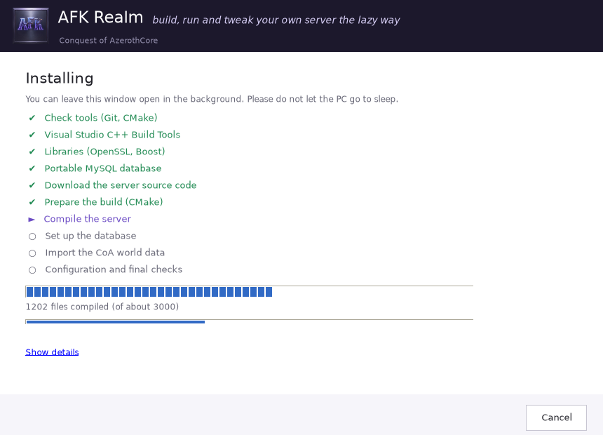

<p align="center"></p>

# AFK Realm

*Go AFK, come back to your own server.*

> [!WARNING]
> **Work in progress and highly experimental.** AFK Realm is unfinished and changes all the time. Every release and every new function has to be seen as experimental. New features are often tested on only one PC before they are published, so it is very likely that one thing or another does not work properly yet. Keep backups of anything you care about (AFK Realm makes one before every update and module change), and if something breaks, please report it with `logs\install.log` attached.

Build, run and tweak your own **Conquest of Azeroth** server (an AzerothCore fork with Playerbots) on Windows 10/11, compiled straight from source, all through a point-and-click interface.



📖 **[User guide](docs/MANUAL.md)** – every window explained: what it is for, when you need it and how to use it.

## About this project

AFK Realm was never planned as a product. I built it for myself: it started as a simple Bash script that compiled my own server, turned into a PowerShell script when the steps piled up, and then got a window on top because I was tired of typing. Since then it keeps growing with whatever I need next for my own server – settings, backups, modules, game master tools.

I'm happy if it is useful to other people too. If something does not work, if something is missing or if you have an idea for what could be better, please tell me: open an [issue](../../issues) or write to me on Discord. Suggestions are very welcome, and a `logs\install.log` makes bug reports much easier to fix.

## Why

Pre-built repacks go stale quickly. Building from source keeps you on the latest fixes, but it needs Git, CMake, Visual Studio, OpenSSL, Boost, MySQL and a lot of patience. This tool does all of that for you and then helps you run the server day to day.

## Features

- **Guided installation**: pick a folder and a database password, then click *Install*
- **Automatic dependencies**: Git, CMake, Visual Studio 2022 C++ Build Tools, OpenSSL 3, Boost 1.87, portable MySQL 8.4, Python and mpqcli, with checksums verified
- **Always current**: every installation builds the newest CoA core and Playerbots
- **Clear progress**: every step, download percentages, compiled files and imported world tables, plus an optional live log
- **Databases ready before the first start**: imports the CoA world package, creates the auth and character databases and applies all SQL updates, and repairs databases whose setup was interrupted
- **Server management**: start and stop (clean shutdown that saves all characters), live status, the servers' output shown right in the window instead of in separate console windows, and the reason shown right away if a server closes while starting
- **Server settings**: a list of popular options (XP, drop and reputation rates, flight paths, cross-faction play, Playerbots count and levels) plus every option of the worldserver and all module configs, searchable, with the description from each template and one-click reset to the default
- **Accounts**: create accounts with GM levels, list all player accounts (bot accounts are filtered out) with their characters, delete accounts, set new passwords and change access levels
- **Account transfer**: export an account with all its characters, items, mail and pets to an `.afkaccount` file and import it on another server – ids are renumbered, taken names are renamed at the next login
- **Game master tools**: a line to the running server (its SOAP service, switched on for this PC only) with a quest helper – find quests by NPC name, quest title or id, or list the open quests around a character, then give, complete, reward or remove them with one click – plus unstuck, revive, level, gold and mail for a character, announcements, and a console for every other GM command
- **Modules**: browse the AzerothCore module catalog, tick modules to install them and untick them to remove them. Before installing, each module is checked (database changes, settings, core patches, client files, age) and its README is one click away. The server is backed up and rebuilt; if a module does not compile, it is taken out again and the server stays as it was. The database changes of every module installed this way are recorded, so removing it undoes them
- **Bot reset**: one click deletes all random bots with their characters, guilds and arena teams (your own characters are kept); new bots are created at the next start
- **Map data**: extracts maps, vmaps, mmaps and the CoA client DBC tables from your game client with one click
- **Play with others**: set a VPN or LAN address (e.g. Radmin VPN); the tool configures the realm, the CoA remote-client setting and the Windows Firewall
- **Updates**: shows when newer server code or a newer AFK Realm release is available; checks the core, Playerbots and your own extra modules, and rebuilds only when something changed
- **Backups and rollback**: before every update the server is saved (programs, settings, all databases and their versions); if a new version causes problems, one click restores the previous state. Backups can also be made by hand; the newest 3 are kept
- **Portable**: everything lives in one folder; the database runs without a Windows service

## Screenshots

| Server settings | Player accounts |
|---|---|
|  |  |
| **Backups** | **Update with automatic backup** |
|  |  |
| **Game master tools** | **Modules** |
|  |  |
| **Installing and removing modules** | |
|  | |
| **Installation** | **Progress** |
|  |  |

## Getting started

The short version is below; the [user guide](docs/MANUAL.md) explains every step and every window in detail.

1. Download `AFK-Realm.exe` from the [Releases](../../releases) page and run it.
   Windows SmartScreen may warn about an unknown publisher because the exe is not code-signed. The exe is built from this repository by GitHub Actions; you can also build it yourself (see below).
2. **Install a new server** → choose a folder such as `C:\CoA-Server` → set a database password → **Install**.
   The installation may take a long time and needs about 40 GB of disk space.
3. In **Server management**:
   1. *Create map data from the game client* (once; choose the game folder that contains the `Data` folder, and keep the game and its launcher closed)
   2. *Create account*
   3. *Start server*
4. Point your client's `realmlist.wtf` to `set realmlist 127.0.0.1` and log in.

You need the CoA game client yourself; it is not part of this project.

## How it works

The window is a small WinForms app (C# 5, .NET Framework 4.x, which is already part of Windows 10/11, no extra runtime needed). All the actual work is done by [`engine/engine.ps1`](engine/engine.ps1), a PowerShell script embedded in the exe. The script works on its own as well:

```powershell
# interactive
powershell -ExecutionPolicy Bypass -File engine\engine.ps1 -InstallRoot C:\CoA-Server
# unattended (modes: Install, Update, Rebuild, Setup, Backup, Restore, Modules)
$env:AC_DB_PASSWORD = '...'
powershell -ExecutionPolicy Bypass -File engine\engine.ps1 -InstallRoot C:\CoA-Server -NonInteractive -Mode Update
```

Sources used:

| Component | Repository | Branch |
|---|---|---|
| Core | [jealous-sound/azerothcore-wotlk-coa](https://github.com/jealous-sound/azerothcore-wotlk-coa) | `main` |
| Playerbots | [Zyth45/mod-playerbots](https://github.com/Zyth45/mod-playerbots) | `coa` |
| MPQ reader | [TheGrayDot/mpqcli](https://github.com/TheGrayDot/mpqcli) | release v0.9.9 |

Every installation and rebuild uses the newest commits of the CoA core and Playerbots; *Update* checks for newer ones later. The exact revisions built are recorded in `Dependencies\revisions.txt` and in the install log.

### Game master tools

When the server is started through AFK Realm, the worldserver's SOAP service is switched on (`SOAP.Enabled = 1`, bound to `127.0.0.1`) and an administrator account `AFKREALMADMIN` with a random password is created for it (the password is kept in `Dependencies\admin-link.txt`). The game master window sends GM commands over that line exactly as the server window would, and reads characters, quests and quest givers from the server's own databases – so everything matches CoA's changed world, unlike online databases.

### Modules and their database changes

Modules installed through *Manage modules* are cloned into `Dependencies\Source\modules`. Their SQL files (`data/sql/db-world`, `db-characters`, `db-auth`) are not left to the core's updater: AFK Realm applies them itself, copies the tables they name beforehand and stores the differences (added, changed and removed rows, new and deleted tables) in the database `afk_modules`, which is part of every backup. The files are then entered into the core's `updates` tables with the core's own hash, so they are never applied twice. Removing the module puts every recorded row and table back, but only rows that still look exactly as the module left them; rows changed later (for example by a server update) are kept and listed in the log. Changes that cannot be recorded (a module that alters the structure of an existing table, or changes tables in other ways) are reported; a backup from before the module restores them. Data players created through a module (items in bags, learned spells) is not tracked.

Folder layout after installation:

```
C:\CoA-Server\
  Server\         authserver, worldserver, configs, Data (map data)
  DB\             portable MySQL and its data
  Dependencies\   tools, source code (modules in Source\modules), build files
  logs\           install.log, mysql-error.log
  Backups\        server backups made before updates (newest 3)
  Builder\        copy of the builder (the desktop shortcut points here)
```

## Troubleshooting

- **Something failed**: the error is shown in the window; the full log is `logs\install.log`. *Try again* continues where it stopped.
- **Visual Studio installation fails**: restart Windows (a pending restart is the most common cause), then try again.
- **Compiler runs out of memory** (errors C1076/C3859): the builder retries automatically with less parallelism; closing games and browsers helps.
- **Worldserver closes with "DataDir does not hold the CoA client DBC set"**: open *Create map data*, choose your CoA game folder and tick *Only refresh the CoA DBC tables*. The stock map extractor cannot read CoA's own patch archives, so the tool extracts these tables with the fork's `apps/coa-dbc/client_dbc.py`.
- **Black screen at the realm selection**: the core is too old for the client's realm cards; run *Check for updates and install*.
- **A module does not compile**: it was taken out again automatically and the server is unchanged; the first compiler error in `logs\install.log` names the problem. Many modules are written for the regular AzerothCore and do not fit CoA.
- **Game master tools say "Stop and start the server once"**: the line to the server is set up when the server is started through AFK Realm; a server that was started earlier or with `START-SERVER.cmd` before the first such start does not have it yet.
- **Friends cannot connect**: set the realm address under *Play with others*, restart the server, and make sure the VPN is connected on both PCs.

## Building the exe yourself

- Windows: run `build.bat`. It uses the C# compiler that ships with Windows.
- Linux: run `build.sh` (needs `mono-devel`).

## Disclaimer

This is an unofficial community tool. It is not affiliated with or endorsed by Blizzard Entertainment, Project Ascension, the AzerothCore project or the authors of the forks it builds. World of Warcraft is a trademark of Blizzard Entertainment. The tool downloads source code from the repositories listed above; their licenses apply to that code.

## License

MIT (see [LICENSE](LICENSE)) for the code in this repository.
