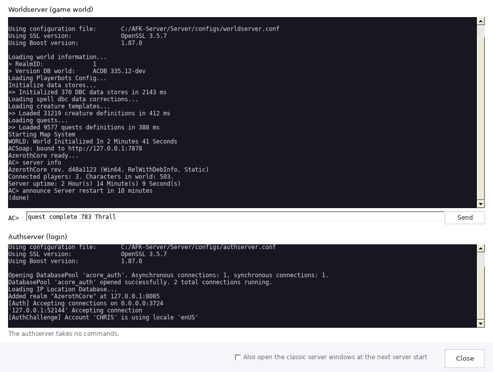
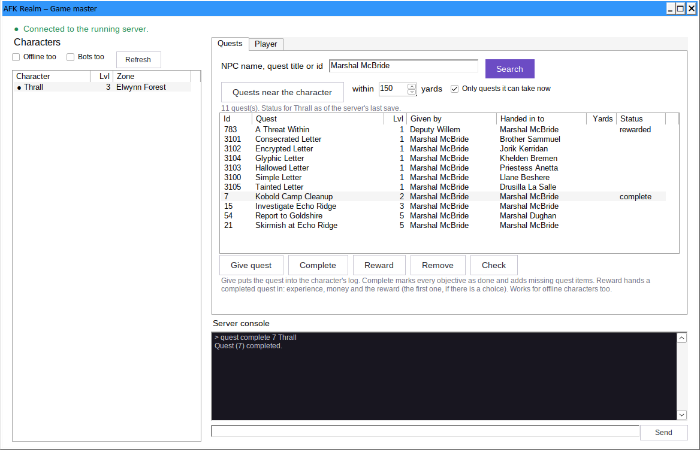
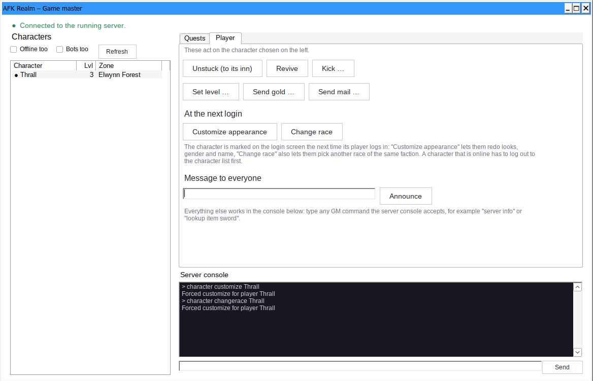

# AFK Realm – User guide

This guide explains every part of AFK Realm: what it is for, when you need it and how to use it.
AFK Realm is work in progress, so a window may look slightly different from the pictures here.

**Contents**

1. [Before you start](#1-before-you-start)
2. [Installing a server](#2-installing-a-server)
3. [Starting and stopping the server](#3-starting-and-stopping-the-server)
4. [Map data](#4-map-data)
5. [Server settings](#5-server-settings)
6. [Game master tools](#6-game-master-tools)
   - [Quests: fixing quests that do not work](#quests-fixing-quests-that-do-not-work)
   - [Player: helping a character](#player-helping-a-character)
   - [Server console](#server-console)
7. [Modules](#7-modules)
8. [Accounts](#8-accounts)
9. [Playing with others](#9-playing-with-others)
10. [Updates, backups and repair](#10-updates-backups-and-repair)
11. [Resetting the random bots](#11-resetting-the-random-bots)
12. [Where everything is stored](#12-where-everything-is-stored)
13. [When something goes wrong](#13-when-something-goes-wrong)

---

## 1. Before you start

You need:

- Windows 10 or 11 (64-bit) and administrator rights
- about 40 GB of free disk space
- an internet connection
- your own Conquest of Azeroth game client (it is not part of AFK Realm)

AFK Realm builds the server from source code. That takes a while and keeps the PC busy; you can leave it running and do something else.

Everything AFK Realm installs goes into the one folder you choose. Nothing is installed as a Windows service.

## 2. Installing a server

1. Start `AFK-Realm.exe`. Windows may warn about an unknown publisher because the program is not code-signed; choose *More info → Run anyway*.
2. Choose **Install a new server**.
3. Pick a folder, for example `C:\CoA-Server`. Use a short path on a local drive.
4. Set a **database password** (at least 10 characters). You do not need to type it again later, but keep it somewhere.
5. Read the summary and click **Install**.

The progress page shows each step. If Visual Studio is missing, its installer window opens along the way; do not close it.

**If a step fails**, the reason is shown. *Try again* continues where it stopped; what is already downloaded or built is kept. If it fails again, send `logs\install.log` with your report.

When the installation is finished, three things are left to do in the server management: create the map data, create an account, start the server.

## 3. Starting and stopping the server

The top of the **Server management** shows the three parts of the server:

| Part | What it does |
|---|---|
| Database | stores accounts, characters and the world |
| Authserver | the login |
| Worldserver | the game world |

- **Start server** starts all three in the right order. The worldserver needs a few minutes to load; you can keep using AFK Realm meanwhile. When it says *The server is running. You can log in now.*, it is ready.
- **Stop server** saves all characters and shuts everything down cleanly. Always stop the server this way.

The servers run in the background without windows of their own. **Open server consoles …** shows both in one window:



- The upper part is the **worldserver**: everything it prints, for example its progress while loading. In the line below it you type GM commands, with or without the leading dot; the answer appears in the console. The arrow keys bring back earlier commands.
- The lower part is the **authserver**. It only reports logins and takes no commands.

The window can stay open next to the server management. Closing it, or closing AFK Realm, does not stop the servers; they keep running, and the consoles show their output again when you open them.

Commands are sent through the same connection as the [game master tools](#6-game-master-tools) use, so they work once the server was started through AFK Realm and has finished loading.

If you prefer the classic console windows, tick **Also open the classic server windows** at the bottom of the window; it applies from the next server start.

If the worldserver closes while starting, AFK Realm shows the last lines of its log, which usually name the reason.

## 4. Map data

The server needs data from your game client: maps, line-of-sight data, pathfinding data and the CoA data tables (DBC).

1. Click **Create map data from the game client …**
2. Choose the folder of your CoA client (the one that contains the `Data` folder).
3. Keep the game and its launcher closed and start the extraction.

A separate window runs the extraction and moves the result into the server when it says DONE. Leave *mmaps* ticked: without them bots and creatures cannot find their way.

**Only refresh the CoA DBC tables** is for a server that already has maps: use it when the worldserver stops with *DataDir does not hold the CoA client DBC set*, which can happen after a client update.

## 5. Server settings

**Open server settings …** edits the configuration files of the worldserver, Playerbots and every module, without opening a text file.

- The list on the left chooses a file. **★ Popular settings** collects the options people change most: experience, drop and reputation rates, number and levels of bots, flight paths, cross-faction play.
- **Search** looks through all files at once.
- **Only changed** shows what differs from the default.
- Click an option to read its description from the configuration template. On/off options have a switch, options with fixed choices a list.
- **Reset** puts the selected option back to its default.
- **Save** writes the files. The previous version of each file is kept next to it as `.afk-backup`.

Changes take effect when the worldserver starts the next time. If it is running, stop and start it.

A few options (database connection, data folder) are managed by AFK Realm itself and cannot be changed here.

After a server update, new options appear automatically with their default values; your own values stay.

## 6. Game master tools

**Game master tools …** is for helping players on the running server: fixing quests, freeing a stuck character, sending gold and so on.

**The connection.** The tools talk to the worldserver through its built-in remote service. AFK Realm sets that up whenever *it* starts the server. If the top line says *Stop and start the server once*, the server was started before the connection existed: stop it and start it again through AFK Realm. A green *Connected to the running server* means everything is ready.

Looking things up (quests, characters) works even when the server is stopped, because that information comes from the database. Changing something needs the running server.

**The character list** on the left shows who is online. Tick **Offline too** to see every character and **Bots too** to include the random bots. Click a character: everything on the right acts on it.

### Quests: fixing quests that do not work



Conquest of Azeroth changes the world, and not every quest survives that. Typical problems:

- The quest giver stands where you cannot click him, so the quest cannot be accepted.
- The quest is done, but the NPC who should take it cannot be reached, so it cannot be handed in.
- A quest item does not drop, or a creature that has to be killed is missing.
- The quest simply does nothing when its objective is fulfilled.

The Quests tab solves these by doing by hand what the game should have done.

**Step 1: find the quest**

- **Search**: type the name of the NPC (or object), the title of the quest, or the quest id, and press *Search*. The list shows every matching quest with who gives it (*Given by*) and who takes it (*Handed in to*). This comes from your server's own database, so it matches CoA; online databases often do not.
- **Quests near the character**: lists the open quests around the selected character, nearest first, with the distance in yards. It also lists quests the character already has and can hand in nearby. With **Only quests it can take now** ticked, quests are left out that its level, race or class do not allow or that need an earlier quest first.

  For a character that is online, the server saves all characters first so that the position is the current one.

The **Status** column shows where the selected character stands with each quest: empty (not taken), *in progress*, *complete* or *rewarded*. For a character that is online, this is the state of the server's last save and can be a few minutes old; *Check* asks the server directly.

**Step 2: choose what to do**

| Button | What it does | Use it when |
|---|---|---|
| **Give quest** | Puts the quest into the character's quest log. | the quest giver cannot be clicked |
| **Complete** | Marks every objective as done and adds missing quest items. | an item does not drop, a creature is missing, the objective does not count |
| **Reward** | Hands a completed quest in: experience, money, reputation and the reward item. | the NPC who takes the quest cannot be reached |
| **Remove** | Takes the quest out of the log again. | a quest is stuck and should be started over |
| **Check** | Asks the server for the quest's state and, if the character cannot take it, why. | you want to know why a quest is not offered |

The server's answer appears in the console at the bottom.

**Example: the quest giver cannot be clicked**

1. Select the character on the left.
2. Type the NPC's name, press *Search* and select the quest.
3. *Give quest*. The player now has the quest and can play it normally.
4. If it cannot be handed in either: when the objectives are done, *Complete* (if needed) and then *Reward*.

**Good to know**

- *Reward* only works for a quest that is complete. If the server refuses, use *Complete* first.
- If a quest offers a choice of rewards, *Reward* gives the first one.
- All of this also works for characters that are offline; they find the result at their next login. A character that is offline gets no reputation from *Reward*.
- Quests that start from an item (a letter, a dropped item) cannot be given this way; the server says so.

### Player: helping a character



| Button | What it does |
|---|---|
| **Unstuck (to its inn)** | Moves the character to its hearthstone location. For characters stuck in the ground, in a broken area or in a place that crashes the client. |
| **Revive** | Brings a dead character back to life. |
| **Kick …** | Logs the player out, with an optional reason shown to them. |
| **Set level …** | Sets the character's level. |
| **Send gold …** | Sends gold by in-game mail. |
| **Send mail …** | Sends an in-game mail with a subject and a text. |
| **Announce** | Shows a message to everyone who is online, for example before a restart. |

### Server console

The dark box at the bottom shows every command AFK Realm sent and the server's answer. In the line below it you can type any GM command the worldserver's console accepts, with or without the leading dot, for example:

```
server info
lookup item thunderfury
pinfo Thrall
```

The arrow keys bring back earlier commands. Commands that need you to stand in the game or to have something selected (for example `.gps` or `.npc move`) do not work from here; use them in the game.

## 7. Modules

**Manage modules …** adds and removes AzerothCore modules.


- The list is the AzerothCore module catalog. Installed modules are ticked.
- **Tick** a module to install it, **untick** it to remove it, then click **Apply changes**.
- Click a module to see what AFK Realm found out about it: whether it brings database changes and settings, whether it needs a change to the server core (not supported), files for the game client or the Eluna module, and when it was last changed. **Show README** opens its description.
- A module that is not in the list can be added by its Git address at the bottom.
- Playerbots and the modules that come with CoA are shown as *included* / *part of CoA* and cannot be changed here.

**What happens on Apply:** the server is stopped and backed up, the modules are downloaded, the server is rebuilt and the modules' database changes are applied.

**Important:** most modules are written for the regular AzerothCore, not for CoA. Many will not compile or will not behave. That is safe to try: if the server cannot be built with a new module, the module is taken out again and your server stays as it was.

**Removing a module** also undoes its database changes, because AFK Realm records them when it installs the module. Rows that were changed again later (for example by a server update) are left alone and listed in the log. The window tells you beforehand if a module made changes that cannot be undone automatically; a backup from before the module restores those.

What players got *through* a module while playing (items, spells) is not tracked and may disappear or stop working when the module is removed.

After installing a module, read its README: some modules need a step in the game, for example creating a character for an auction house bot. A module's options appear in the [server settings](#5-server-settings).

## 8. Accounts

**Create account** in the server management: name, password and access level.

| Access level | Meaning |
|---|---|
| Player | normal player |
| Moderator (GM 1), Game Master (GM 2) | may use some or most GM commands in the game |
| Administrator (GM 3) | may use every command |

**Manage player accounts …** lists the accounts of real players (the bot accounts are hidden) with their characters and last login. For the selected account you can:

- **Delete account …** – the server must be stopped. The characters are removed for good at the next server start.
- **New password …**
- change the **access level**
- **Export …** – writes the account with all its characters, items, mail and pets into an `.afkaccount` file
- **Import account file …** – reads such a file into this server; the server must be stopped. If a character name is already taken, the player is asked for a new one at the next login. Guild, group and arena team memberships are not carried over.

Export and import are how you move a player from one server to another, for example from a test server to the real one.

## 9. Playing with others

By default only you can reach the server (`127.0.0.1`). To let others in:

1. Connect the PCs through a VPN such as Radmin VPN or Hamachi, or use your LAN.
2. In **Play with others**, enter the address the others use to reach your PC (the VPN address of your PC, or its LAN address) and click **Apply**.
3. Stop and start the server.
4. The other players set this address in their `realmlist.wtf`. You keep using `127.0.0.1`.

AFK Realm also allows the servers through the Windows Firewall.

## 10. Updates, backups and repair

**Updates.** A banner at the top appears when newer server code (CoA core, Playerbots) or a newer AFK Realm is available. **Check for updates and install** downloads the newest code and rebuilds only what changed. Before it changes anything, the server is backed up.

**Backups …** lists the backups. A backup holds the server programs, the settings and all databases, together with the versions they were built from.

- One is made automatically before every update and every module change.
- **Back up now** makes one by hand, for example before you try something risky.
- **Restore …** puts the server back to that moment. Everything that happened since then is lost: character progress, new accounts, changed settings.
- The newest three backups are kept; older ones are deleted.

Map data is not part of a backup; updates do not touch it.

**Repair setup** sets up the database and configuration again without rebuilding the server. Characters and accounts are kept. Use it when the server does not start after something was interrupted.

## 11. Resetting the random bots

**Reset random bots …** deletes every random bot with its characters, guilds, arena teams and mail. Your own accounts and characters are kept, including bots you created on your own accounts. New bots are created at the next server start, which then takes longer than usual.

Use it after changing bot settings that only apply to newly created bots (for example their level range), or when the bots have become a mess.

## 12. Where everything is stored

```
C:\CoA-Server\
  Server\         authserver, worldserver, configs, Data (map data), server logs
  DB\             the database and its data
  Dependencies\   build tools, source code, build files
  logs\           install.log, mysql-error.log
  Backups\        the newest three backups
  Builder\        a copy of AFK Realm (the desktop shortcut points here)
```

- **Open folder** and **Open server logs** in the server management take you there.
- To move the server to another PC, use a fresh installation there and move the players with account export and import.
- To remove everything, stop the server and delete the folder.

## 13. When something goes wrong

| What you see | What to do |
|---|---|
| A step of the installation fails | Read the message, click *Try again*. If it fails again, report it with `logs\install.log`. |
| Visual Studio cannot be installed | Restart Windows (a pending restart is the most common cause) and try again. |
| The worldserver closes while starting | AFK Realm shows the end of its log. The full log is `Server\Server.log`. |
| *DataDir does not hold the CoA client DBC set* | *Create map data* → tick *Only refresh the CoA DBC tables*. |
| Black screen at the realm selection | Run *Check for updates and install*. |
| Friends cannot connect | Check the realm address under *Play with others*, restart the server, check the VPN on both PCs. |
| Game master tools: *Stop and start the server once* | Stop and start the server through AFK Realm. |
| A module does not compile | Nothing to do: it was taken out again. It does not fit CoA. |
| The server misbehaves after an update or a module | *Backups → Restore* the backup made before it. |

When you report a problem, attach `logs\install.log` and say what you clicked and what you expected. That makes it much easier to fix.
